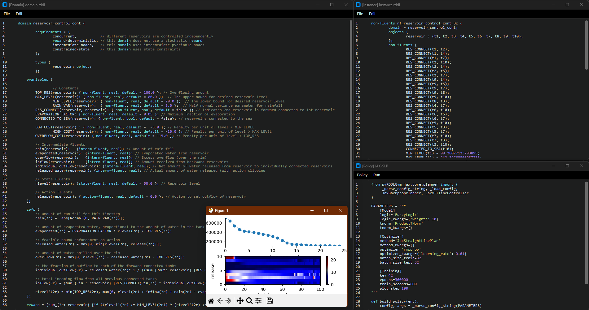

# RDDL-IDE

Author: [Mike Gimelfarb](https://mike-gimelfarb.github.io)

Graphical integrated development environment for RDDL.

This directory provides an IDE:
1. specifically designed for reading and writing RDDL descriptions (supports syntax highlighting and some debugging features)
2. with support for running, visualizing and recording policies
3. with native support for the pyRDDLGym [ecosystem](https://github.com/pyrddlgym-project) and planning baselines (e.g. [JAX planner](https://github.com/pyrddlgym-project/pyRDDLGym-jax), [Gurobi planner](https://github.com/pyrddlgym-project/pyRDDLGym-gurobi), [RL](https://github.com/pyrddlgym-project/pyRDDLGym-rl)).

<p align="center">

</p>

## Contents
- [Installation](#installation)
- [Running the IDE](#running-the-ide)

## Installation

To install, you will need ``pyRDDLGym>=2.0`` from [here](https://github.com/pyrddlgym-project/pyRDDLGym), and for the GUI to work you also need ``pygments``, ``customtkinter`` and ``CtkMenuBar``. To run the various baselines, you will also need the 
[prerequisite packages](https://github.com/pyrddlgym-project). 

To install directly with pip with all the preprequisites:

```shell
pip install git+https://github.com/pyrddlgym-project/rdd-ide
```
## Running the IDE

To launch the IDE, simply type:

```shell
python -m rddl_ide.run
```
